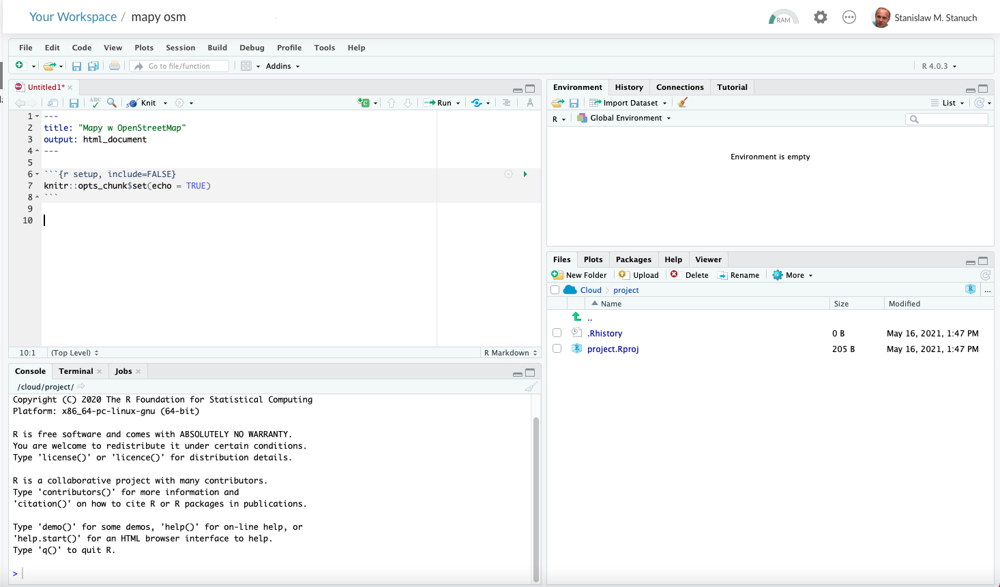

```{r setup, include=FALSE}
knitr::opts_chunk$set(echo = FALSE)
library(leaflet)
library(tidyverse)
library(mapview)
```

W kwietniu 2015 roku Nepal został poważnie zniszczony przez silne trzęsienie ziemi. Na ratunek ruszyły służby ratownicze i organizacje humanitarne z całego świata. Jednak Nepal to nie Europa i tu nie było pojazdów Google, a i samemu koncernowi na dostarczaniu dokładnych map wiosek, zagubionych gdzieś w Himalajach, specjalnie nie zależy.

Dlaczego o tym piszę? Bo wcześniej w Haiti, a później w Nepalu okazało się, jak przydatne są mapy OpenStreetMap i nieprzydatne Googla czy Binga. Ta pierwsza aktualizowana może być przez każdego i praktycznie natychmiast, te drugie aktualizowane są co jakiś czas i tylko przez ich wydawców.

Nieszczęścia w Haiti i Nepalu są chyba najlepszym przykładem użyteczności OpenStreetMap i jego przewagi nad rozwiązaniami komercyjnymi. Problemem na jakie natrafili bowiem ratownicy i organizacje pomocowe był brak map tych terenów, zniszczeń, dróg dojazdowych czy miejsc gdzie ludzie potrzebują pomocy. Wolontariusze z całego świata (zobacz zdjęcie poniżej) błyskawicznie i na bieżąco tworzyli, na podstawie zdjęć satelitarnych, zgłoszeń i map papierowych, mapy zniszczeń, dróg dojazdowych i miejsc gdzie ludzie potrzebują pomocy.[^1]

[^1]: <https://www.hotosm.org/updates/2015-05-01_nepal_earthquake_we_have_maps>


Chociażby te dwa przykłady, pokazują, że warto zainteresować się OpenStreetMap, bo korzystanie z niej nie jest ograniczone - jak w przypadku rozwiązań komercyjnych - różnymi obostrzeniami, a poza tym mapy, szczególnie w przypadku szczegółowych map, obejmujących np. ścieżki czy elementy infrastruktury, są dużo dokładniejsze.

No ale co ja tu będę... parę dni temu izraelskie wojsko zniszczyło budynek w którym m.in. mieściły się biura dwóch agencji: AP i Al-Jazeera. Budynek mieścił się w mieście Gaza przy Al-Jalaa Street. Poniżej dwie mapy, prezentujące ten obszar: pierwsza z Google Maps, druga w OpenStreetMap. Znajdź różnicę :-)

```{r echo=FALSE, fig.cap="Gaza, Al-Jalaa Street w Google Maps"}
leaflet() %>% 
  setView(34.46920,31.53013, zoom = 17) %>% 
  addTiles(urlTemplate = "http://mt0.google.com/vt/lyrs=m&hl=en&x={x}&y={y}&z={z}&s=Ga", attribution = 'Google Maps')
```

```{r echo=FALSE, fig.cap="Gaza, Al-Jalaa Street w OpenStreetMap"}
leaflet() %>% 
  setView(34.46920,31.53013, zoom = 17) %>% 
  addProviderTiles(provider = providers$OpenStreetMap)
```

Dzięki OSM (OpenStreetMap) możemy skorzystać z dziesiątek wyspecjalizowanych podkładów np. mapy dla rowerzystów, mieszać je ze sobą, a nawet tworzyć własne. Skomponowane przez siebie mapy, można umieszczać (embedować) na stronie internetowej, tworzyć z nich osobną stronę w internecie, a także zapisać w formie pliku graficznego o dowolnych rozmiarach i rozdzielczości.

O tym jak każdy, **nawet osoba nie mająca pojęcia o tworzeniu map i nie potrafiąca programować**, może stworzyć własne mapy, będzie ten tekst. Potrzeba jedynie trochę odwagi w użyciu nieznanych narzędzi, co w leadzie nazwałem "brawurą" :-)

## Co się nauczysz?

-   Jak zrobić mapę dowolnego miejsca na świecie i

```{r zakopane, echo=FALSE, fig.cap="Zakopane, klasyczna mapa OpenStreetMap"}
leaflet() %>% 
  setView(19.9499, 49.2950, zoom = 15) %>% 
  addTiles()

```

-   przedstawić ją z wybranym podkładem.

```{r zakopane-stamen-lite, echo=FALSE, fig.cap="Zakopane, podkład Stamen Lite"}
leaflet() %>% 
  setView(19.9499, 49.2950, zoom = 15) %>%
  addProviderTiles(provider = providers$Stamen.TonerLite)

```

```{r zakopane-esri, echo=FALSE, fig.cap=" Zakopane, podkład ESRI"}
leaflet() %>% 
  setView(19.9499, 49.2950, zoom = 15) %>%
  addProviderTiles(provider = providers$Esri)

```

```{r zakopane-watercolor, echo=FALSE, fig.cap="Zakopane, podkład Stamen Watercolor"}
leaflet() %>% 
  setView(19.9499, 49.2950, zoom = 15) %>%
  addProviderTiles(provider = providers$Stamen.Watercolor)
```

-   stworzyć mapę o niestandardowym rozmiarze

```{r zakopane-prostokąt, echo=FALSE, out.width="640px", out.height="120px",  fig.cap="Zakopane, podkład klasyczny, rozmiar 640 x 120"}
leaflet() %>% 
  setView(19.9499, 49.2950, zoom = 15) %>%
  addTiles()
```

-   wyeksportować mapę w formie pliku HTML

-   wyeksportować mapę w formie pliku graficznego

-   jak skorzystać z bezpłatnego, ale ograniczonego czasowo (15h / miesiąc) środowiska programistycznego Rstudio Cloud (w chmurze), a jeśli Ci się spodoba taka zabawa to...

-   ...jak zainstalować na swoim komputerze (bezpłatne) środowisko programistyczne Rstudio, używane przez większość programistów R

### Wymagania czyli co potrzebujesz by tworzyć mapy?

-   dowolny komputer (Win, Mac, Linux) z dostępem do internetu

-   odrobinę czasu

-   nieco brawury i odwagi w poznawaniu nowych rzeczy

### Konto w Rstudio.Cloud

No to zaczynamy. Pierwszą rzeczą, która będzie nam potrzebna jest środowisko do programowania w języku R. To oprócz Pythona, jeden z dwóch najpopularniejszych języków programowania używanych przez analityków i specjalistów od data science, uczenia maszynowego, infografiki. Używają go również czołowe redakcję na świecie do tworzenia analiz i wykresów.[^2]

[^2]: Zobacz artykuł w Financial Times o Covid-19 <https://www.ft.com/content/a2901ce8-5eb7-4633-b89c-cbdf5b386938>

Najłatwiej będzie zacząć od stworzenia konta na [RStudio Cloud](https://rstudio.cloud) czyli środowisku programistycznym dla R, które można używać z dowolnej przeglądarki internetowej. Dzięki temu, po założeniu konta w bezpłatnym planie, będziesz miał od razu wszystko, co jest potrzebne do stworzenia map.

No więc po kolei:

1.  Wejdź na stronę [\<https://rstudio.cloud\>](https://rstudio.cloud) i załóż darmowe konto.
2.  Po założeniu konta kliknij stwórz nowy projekt ("New Project")
3.  W nowym projekcie kliknij na File-\> New File -\> R Script

W punkcie trzecim stworzyliśmy nowy dokument do pisania programów (skryptów) w języku R i w nim stworzymy naszą pierwszą mapę.

## Mapa z klasycznym podkładem OSM - krok po kroku

Jeśli wszystko poszło OK, a zapewne tak było, to Twój ekran wygląda tak:



Ekran podzielony jest na cztery części:

1.  Górna-lewa to edytor do pisania programów i tu będziesz pisał program rysujący mapę.
2.  Górna-prawa to miejsce gdzie m.in. przyglądamy się zmiennym, tworzonym przez nas skrypt. W zasadzie nie będzie Ci teraz do niczego potrzebny.
3.  Dolna-lewa to konsola. Można tu wpisywać polecenia języka R. Nie będziesz tego teraz używał.
4.  Dolna-prawa to miejsce gdzie najczęściej wyświetlamy zawartość folderu projektu, ale jest tu też pomoc do R i jego bibliotek czy zakładka do instalowania bibliotek (packages). Tę ostatnią użyjemy, ale tylko raz, bo biblioteki trochę jak programy w komputerze, instaluje się raz, a potem w razie potrzeby jedynie wczytuje.

Najgorsze za nami, teraz możemy przejść do napisania programu, który wyświetli nam pierwszą mapę. Zanim jednak przejdziemy do pisania kodu, musimy zainstalować trzy biblioteki, które będą nam potrzebne. **Instalujemy tylko raz,** więc kiedy następny raz otworzysz swój projekt, nie musisz ich ponownie instalować.

1.  Kliknij w zakładkę "packages" w dolnym-prawym rogu.
2.  Kliknij w przycisk "Install"
3.  W okienku w polu Packages wpisz: 'tidyverse" daj odstęp (spację) i wpisz "leaflet", znowu odstęp i wpisz "mapview", a następnie kliknij w "install".
4.  Po chwili, Rstudio zacznie instalować biblioteki, co sprowadza się do ściągnięcia ich z serwerów CRAN i zainstalowania w Twoim systemie.
5.  W konsoli po prawej stronie zobaczysz czerwoną ikonkę, która oznacza, że Rstudio jest "czymś" zajęty, a na ekranie konsoli wyświetlane będą polecenia związane z instalowaniem bibliotek. Może się zdarzyć, że Rstudio zapyta Cię czy instalować ze źródła i da Ci możliwość odpowiedzi (Yes/No). Wpisz "Y" czyli, że tak :-)

Jeśli instalowanie bibliotek przebiegło bez problemu, to możemy przejść do pisania kodu pierwszej mapy. Kod, który ją tworzy jest poniżej. Wyjątkowo skopiuj go i wklej do edytora (Górne-lewe okienko). Piszę wyjątkowo, bo metoda copy-paste, chociaż oczywiście dozwolona, nie jest najlepszym sposobem na nauczenie się programowania. Tak naprawdę uczymy się i zapamiętujemy polecenia, wtedy gdy je samodzielnie wpisujemy. Sprawdza się tu jak zawsze, że praktyka czyni mistrza. Dlatego tym razem skopiuj, ale następne przykłady po prostu przepisz, a z czasem zaczniesz po prostu sam pisać z tzw. głowy :-)

Zróbmy mapę jakiegoś miejsca w Zakopanem. Niech to będzie oczko wodne przy Krupówkach. Najpierw skopiuj kod poniżej i wklej do swojego dokumentu, a następnie przeczytaj poniżej moje wyjaśnienie działania kodu.

```{r echo=TRUE, fig.cap="Rysowanie mapy, podkład OpenStreetMap. Oczko wodne na Krupówkach w Zakopanem"}

# wczytanie bibliotek
library(leaflet)
library(tidyverse)

# definicja współrzędnych punktu (oczko wodne na Krupówkach w Zakopanem) na mapie

lng <- 19.95668
lat <- 49.29269

# rysowanie mapy

leaflet() %>%
  setView(lng = lng, lat = lat, zoom = 20) %>% 
  addTiles()

```

Co robi i jak działa, te kilka linijek kod?

Wszystkie wiersze rozpoczynające się od znaku \# to komentarz. Warto go stosować nie tyle dla innych, ale być może przede wszystkim dla siebie. Dzięki temu gdy zaglądniesz do kodu po roku, będziesz wiedział jak działa.

1.  Pierwsze dwie linijki to wczytanie potrzebnych nam bibliotek (leaflet - do tworzenia map, tidyverse - do różnych funkcji, o których teraz nie ma sensu pisać. Uwierz, że jest potrzebna :-) i mapview z której skorzystamy przy zapisie mapy do pliku html albo pliku graficznego)
2.  kolejne dwie linijki to współrzędne geograficzne punktu, który będzie w środku mapy. W tym wypadku są to współrzędne oczka wodnego na Krupówkach w Zakopanem. Współrzędne dowolnego punktu na Ziemi możesz znaleźć w OpenStreetMap i Google Maps. Klikasz w wybrany punkt, naciskasz prawy klawisz myszki i z menu wybierasz odpowiednią pozycję, a następnie kopiujesz współrzędne do Schowka.
3.  Kolejna linijka, to miejsce gdzie zaczyna się właściwa zabawa. *leaflet()* to funkcja, która rysuje "ramkę" mapy oraz dodaje przycisk do powiększania/pomniejszania wyświetlanego obszaru. Specjalną funkcję pełni tu ciąg znaków "*%\>%*", to tzw. pipe czyli operator, który powoduje, że wynik operacji po lewej stronie, zostaje przekazany do funkcji po prawej stronie. Wiem, wiem, trudne, ale przyjmij, że tak ma być :-)
4.  Kolejna linijka "ustawia" środek mapy w punkcie o zdefiniowanych wcześniej współrzędnych. Dodatkowo jednym z jej parametrów (obowiązkowym) jest tzw. "zoom" czyli poziom powiększenia.
5.  Ostatnia linijka pobiera i wyświetla z serwerów OpenStreetMap fragment mapy dla wybranego wcześniej obszaru.

Mamy kod i pewnie chciałbyś zobaczyć mapę, którą wyświetla. W tym celu musimy uruchomić napisany kod. Można to zrobić na kilka sposobów, ale ponieważ na razie mamy jedną mapę do wyświetlenia, to skorzystamy z najprostszego czyli uruchomienia całego kodu, jaki jest w dokumencie.

1.  Umieść kursor w dokumencie z kodem
2.  Naciśnij kombinację klawiszy \<Shift\>\<Control\>\<Enter\>

Jeśli nie popełniłeś wcześniej błędu w kodzie, to po mrugnięciu okiem :-), w Viewerze (prawe-dolne okienko) zobaczysz mapę centrum Zakopanego.

Teraz poeksperymentuj z kodem np. zmieniając zoom albo, dlaczego by nie, współrzędne punktu. Eksperymentując nabierasz wprawy. Warto.

## Zmiana podkładu mapy

Nasza pierwsza mapa miała standardowy podkład OpenStreetMap, ale pisałem wcześniej, że jedną z zalet samodzielnego tworzenia map np. w języku R jest możliwość wyboru podkładu, a nawet ich mieszania ze sobą.

Na samym końcu dokumentu skryptu dodaj poniższy kod. UWAGA: tym razem spróbuj go przepisać. Ostatecznie mój komentarz (to co jest po znaku \#), możesz pominąć :-)

```{r echo=TRUE, fig.cap="Rysowanie mapy, podkład OpenStreetMap. Oczko wodne na Krupówkach w Zakopanem"}

# mapa z wykorzystaniem podkładu CartoDB.Positron

# Jeśli kod jest w tym samym dokumencie, to nie musisz ponownie wczytywać bibliotek. 
# Jeśli w nowym (osobnym) to odremuj wczytanie bibliotek.

# library(leaflet)
# library(tidyverse)

# definicja współrzędnych punktu (oczko wodne na Krupówkach w Zakopanem) na mapie

lng <- 19.95668
lat <- 49.29269

# rysowanie mapy z podkładem CardoDB.Positrion

leaflet() %>%
  setView(lng = lng, lat = lat, zoom = 20) %>% 
  addProviderTiles(provider = providers$CartoDB.PositronNoLabels)
```

Aby uruchomić kod, zastosujemy teraz inny sposób, bo nie musimy uruchamiać kodu od początku, tylko od miejsca gdzie wpisałeś nowy.

1.  Zaznacz nowo wpisany kod
2.  Naciśnij kombinację klawiszy \<CTRL\>\<Enter\> albo kliknij w przycisk "Run"
3.  Po chwili w prawym dolnym okienku (Viewerze) zobaczysz mapę.

Jak widzisz powyżej, ta mapa wyraźnie różni się od poprzedniej. Pomijając już brak kolorów, to nie ma w niej zupełnie oznaczeń nazw ulic. Można to łatwo dodać i tu przechodzimy do

### Łączenie podkładów

Łączenie podkładów to technika, która często wzbogaca mapę o elementy umożliwiające odbiorcy na lepsze zorientowanie się w terenie. Przykładem może być podkład z mapy satelitarnej z nałożonym na niego podkładem z siatką ulic i nazwami.

Na przykładzie powyższej mapy, pokażę Ci jak łączyć podkłady.

```{r echo=TRUE, fig.cap="Łączenie podkładów map. Oczko wodne na Krupówkach w Zakopanem"}
# Łączenie podkładów

# Jeśli kod jest w tym samym dokumencie, to nie musisz ponownie wczytywać bibliotek.
# Jeśli w nowym (osobnym) to odremuj wczytanie bibliotek

# library(leaflet)
# library(tidyverse)

# definicja współrzędnych punktu (oczko wodne na Krupówkach w Zakopanem) na mapie

lng <- 19.95668
lat <- 49.29269

# rysowanie mapy z podkładem CardoDB.Positrion

leaflet() %>%
  setView(lng = lng, lat = lat, zoom = 20) %>% 
  addProviderTiles(provider = providers$CartoDB.PositronNoLabels) %>% 
  addProviderTiles(provider = providers$CartoDB.PositronOnlyLabels)
```

1.  Dodaj kod na końcu dokumentu, który już mamy
2.  Zaznacz nowo dodany kod
3.  Naciśnij \<CTRL\>\<Enter\>

Zauważ, że nowy kod od poprzedniego różni się... jedną dodaną linijką z funkcją dodania nowej warstwy (podkładu), który zawiera tylko etykiety. Ta technika sprawdzi się, gdy dodajemy podkład transparentny, jak w przykładzie z etykietami. Technikę tą można wykorzystywać do osiągania ciekawych efektów np. dodania do zdjęcia satelitarnego linii i nazw ulic.

```{r echo=TRUE, fig.cap="Rysowanie mapy, łączenie podkładów: mapa satelitarna i etykiety. Oczko wodne na Krupówkach w Zakopanem"}
# mapa z wykorzystaniem podkładu CartoDB.Positron

# Jeśli kod jest w tym samym dokumencie, to nie musisz ponownie wczytywać bibliotek.
# Jeśli w nowym (osobnym) to odremuj wczytanie bibliotek

# library(leaflet)
# library(tidyverse)

# definicja współrzędnych punktu (oczko wodne na Krupówkach w Zakopanem) na mapie

lng <- 19.95668
lat <- 49.29269

# rysowanie mapy z podkładem CardoDB.Positrion

leaflet() %>%
  setView(lng = lng, lat = lat, zoom = 17) %>% 
  addProviderTiles(provider = providers$Esri.WorldImagery) %>% 
  addProviderTiles(provider = providers$Stamen.TonerLines) %>% 
  addProviderTiles(provider = providers$Stamen.TonerLabels)
```

**Ćwiczenie:**

-   poeksperymentuj trochę z różnymi podkładami. Ich wybór jest łatwy, gdy wpisujesz argument funkcji "addProviderTiles(provider = providers\$" i po dodaniu znaku dolara pojawi Ci się lista dostępnych podkładów. Więc by zmienić podkład na inny, zaznacz nazwę podkładu wraz ze znakiem dolara, a następnie wpisz znak dolara i pojawi się lista, z której możesz wybrać nowy podkład.
-   Nie wszystkie podkłady z listy Ci się wyświetlą. Wynika to z faktu, że niektóre z nich wymagają tzw. tokena, a to wiąże się z założeniem konta na serwerze dostawcy. Na szczęście wybór dostepnych podkładów bez tokenów, jest spory, więc myślę, że każdy znajdzie coś dla siebie.

## Zapisanie mapy w pliku graficznym png/jpeg

Do zapisania mapy stworzonej przez bibliotekę *leaflet* wykorzystamy funkcję *mapshot* z biblioteki *mapview*. Przepisz kod poniżej w swoim dokumencie, a następnie zaznacz go i uruchom (\<CTRL\>\<Enter\>)

```{r echo=TRUE, eval=FALSE}

m <- leaflet() %>%
  setView(lng = lng, lat = lat, zoom = 17) %>% 
  addProviderTiles(provider = providers$Esri.WorldImagery) %>% 
  addProviderTiles(provider = providers$Stamen.TonerLines) %>% 
  addProviderTiles(provider = providers$Stamen.TonerLabels)

mapshot(m, file = "zakopane_sat.png")
```

Są dwie zmiany w kodzie: w pierwszej linijce przypisaliśmy "mapę" do zmiennej o nazwie "m". Możesz sobie dać dowolną nazwę zmiennej, byle był to jeden wyraz, a jeśli są dwa lub więcej, to zamiast odstępu dajemy znak podkreślenia *np. oczko_wodne.* Druga zmiana to ostatnia linijka, gdzie zapisujemy wygenerowaną mapę, przechowywaną w zmiennej '*m*', w formie pliku graficznego. Rodzaj pliku definiuje rozszerzenie w nazwie pliku. Możesz użyć "jpeg", "png" czy "pdf".

Po uruchomieniu kodu w folderze projektu zapisany zostanie plik "zakopane_sat.png".

### Mapa o niestandardowych wymiarach

W przykładzie \@ref(fig:zakopane-prostokat) jest mapa o niestandardowych rozmiarach (640x220). Jeśli chcesz stworzyć plik graficzny z mapą o wybranych rozmiarach, wówczas musisz zdefiniować ten rozmiar w kodzie mapy. Robimy to dodając dwa argumenty: *height* i *width* do funkcji *leaflet()*. Reszta kodu, pozostaje bez mian:

```{r echo=TRUE, eval=TRUE}

m <- leaflet(height = 250, width = 600) %>%
  setView(lng = lng, lat = lat, zoom = 17) %>% 
  addProviderTiles(provider = providers$Esri.WorldImagery) %>% 
  addProviderTiles(provider = providers$Stamen.TonerLines) %>% 
  addProviderTiles(provider = providers$Stamen.TonerLabels)

mapshot(m, file = "zakopane_sat_600x250.png")
```

## Zapisanie mapy w pliku html

Zapisanie w pliku html działa w zasadzie tak samo. Różnica to argument *url* w funkcji *mapshot*, która definiuje nazwę pliku html.

```{r echo=TRUE, eval=FALSE}

m <- leaflet(height = 250, width = 600) %>%
  setView(lng = lng, lat = lat, zoom = 17) %>% 
  addProviderTiles(provider = providers$Esri.WorldImagery) %>% 
  addProviderTiles(provider = providers$Stamen.TonerLines) %>% 
  addProviderTiles(provider = providers$Stamen.TonerLabels)

mapshot(m, url = "zakopane_sat.html")
```

```{r echo=FALSE, fig.cap="Zakopane, mapa o rozmiarach 600x250"}

leaflet(height = 250, width = 600) %>%
  setView(lng = lng, lat = lat, zoom = 17) %>% 
  addProviderTiles(provider = providers$Esri.WorldImagery) %>% 
  addProviderTiles(provider = providers$Stamen.TonerLines) %>% 
  addProviderTiles(provider = providers$Stamen.TonerLabels)
```

## Wstawienie mapy na stronie internetowej

Każdą wygenerowaną mapę, która jest zapisana w pliku html, można wstawić przy pomocy standardowych tagów iframe. Na przykład:

    <iframe height="250px" width="600px" src="zakopane_sat.html" 
    title="mapa o moich rozmiarach"></iframe>

## Instalacja R i Rstudio

Jeśli dotarłeś do tego miejsca, zrobiłeś wszystkie przykłady i chciałbyś robić sobie mapy, bez strachu, że skończy Ci się limit godzin w bezpłatnym koncie Rstudio.Cloud, to zainstaluj na swoim komputerze język R i środowisko programistyczne Rstudio. W efekcie będziesz miał to samo, co w Rstudio.Cloud, tylko na swoim komputerze.

1.  Pobierz i zainstaluj język R. Pliki dla każdego systemu operacyjnego znajdziesz na stronie [R-Project](https://www.r-project.org)
2.  Pobierz i zainstaluj [Rstudio Desktop](https://www.rstudio.com/products/rstudio/)

Rstudio integruje się z R, więc jeśli będziesz chciał zrobić mapę, to po prostu uruchamiasz Rstudio Desktop.

Jakieś pytanka? Wątpliwości? Zapraszam do komciów poniżej albo na [Twitterze](https://twitter.com/dziennikarz)

P.S. Czy będzie kontynuacja? **Tak, będzie.**
