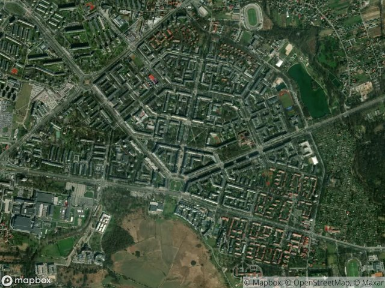
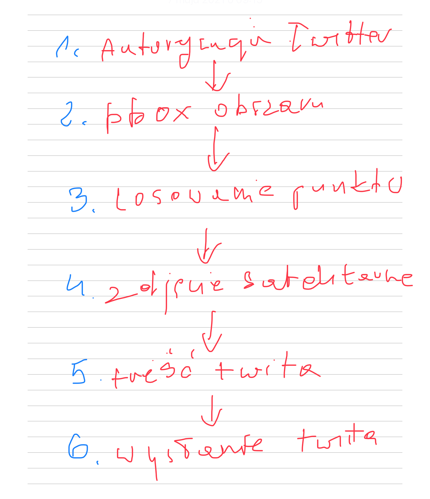
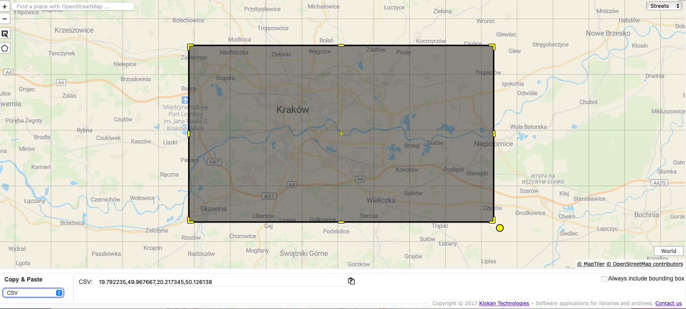

```{r setup, echo=FALSE, include=FALSE}
knitr::opts_chunk$set(echo = FALSE)
```

W Wikipedii przeczytamy, że bot to "program, wykonujący pewne czynności w zastępstwie człowieka". [^1] Najważniejsze w tej definicji jest to, że bot to program, a więc sekwencje poleceń, wykonywanych przez komputer. Immanentną cechą botów jest to, że wykonują one swój program w reakcji na "coś". Tym impulsem, który uruchamia wykonanie programu bota może być czas, np. co godzinę, ale również informacja np. opublikowanie artykułu czy zadanie botowi pytania przez internautę. Program jaki wykonuje bot, zależy tylko i wyłącznie od programisty. Można mu zdefiniować, wszystko co można zaprogramować na komputerze. W praktyce jednak boty bardzo często wykonują czynności, które automatyzują pracę człowieka. Na przykład mogą publikować w serwisie społecznościowym post z zaprogramowaną treścią. Mogą to być popularne na Telegramie czy Messengerze - czatboty, czyli boty, które "odpowiadają" na pytania internautów. Sky is the limit.

[^1]: [https://pl.wikipedia.org/wiki/Bot\_(program)](https://pl.wikipedia.org/wiki/Bot_(program))

## Boty na Twitterze

Twitter od bardzo dawna, prawie od początku tego serwisu, używany jest jako platforma do różnego rodzaju botów. Najczęściej ich działanie ogranicza się do publikowania co jakiś czas twita zawierającego tekst i/lub zdjęcie. Taka forma botów jest najpopularniejsza, i o ile nie jest spamem, lub treść twitów nie łamie regulaminu serwisu, to akceptowana przez Twittera.

W mojej karierze programisty w [R](https://www.r-project.org) zrobiłem, dobrych kilka lat temu, dwa boty (obydwa już nie działają). Pierwszy codziennie rano publikował, na moim koncie [Dziennikarz](https://twitter.com/dziennikarz) prognozę pogody dla Krakowa. Drugi kilka razy dziennie publikował zdjęcia obrazów znanych malarzy oraz podpis zawierający nazwę obrazu, imię i nazwisko malarza oraz muzeum w którym obraz się znajduję. Ten drugi wkrótce pojawi się w nowej formie.

Na przełomie kwietnia i maja 2021 zrobiłem dwa kolejne boty, które w godzinach od 8 do 22, mniej więcej co godzinę, publikują losowo wybrany punkt w Krakowie [^2] lub Warszawie [^3] , oraz tworzą interaktywną mapę opublikowanych do tej pory punktów. [^4]

[^2]: <https://twitter.com/botkrakow>

[^3]: <https://twitter.com/warszawabot>

[^4]: Dla Krakowa jest to <https://botkrakow.netlify.app> a dla Warszawy <https://warszawabot.netlify.app>

Impulsem, który mnie skłonił do zrobienia dwóch ostatnich botów był bot [Matta Dray'a](https://twitter.com/mattdray) o nazwie "Londonmapbot". Inspiracją był nie tyle sam pomysł stworzenia bota, który publikuje zdjęcia satelitarne, ile wykorzystanie jednej z funkcji serwisu [Github](https://github.com) o nazwie [Github Actions](https://github.com/features/actions). Wiedziałem o jej istnieniu i do czego służy, ale nigdy wcześniej jej nie wykorzystywałem. Tymczasem jak powie pewnie każdy programista, nie ma lepszej nauki, nowej technologii, jak zastosowanie jej w praktyce.

Drugim powodem dla którego zrobiłem obydwa boty jest chęć lepszego poznania miasta, w którym żyję, czyli Krakowa. Miejsca gdzie mieszkamy, znamy z perspektywy naszego wzroku. Rozpoznajemy charakterystyczne punkty i najczęściej po tym poznajemy w której części miasta jesteśmy. Obraz satelitarny jest nieco inny. Pozwala z jednej strony rozpoznać znane nam charakterystyczne miejsca, ale z drugiej pokazuje nam okolice z siatką ulic, formą zabudowy, roślinnością, co z normalnej perspektywy jest niewidoczne. Na przykład, jeśli spojrzymy na zdjęcie satelitarne starej część Nowej Huty, to zauważymy charakterystyczny układ z blokami, siatką ulic i mnóstwem zieleni.



Historycznie rzecz ujmując to pierwszy powstał [botkrakow](https://twitter.com/botkrakow) i dopiero gdy dziennikarz [Michał Potocki](https://twitter.com/mwpotocki) zapytał czy nie zrobiłbym takiego samego dla Warszawy [^5], to po niewielkiej przeróbce kodu, też go opublikowałem.

[^5]: <https://twitter.com/mwpotocki/status/1388946058085011457>

<blockquote class="twitter-tweet">

<p lang="pl" dir="ltr">

Warszawa też wnosi o stworzenie takiego bota :).

</p>

--- Michał Potocki (@mwpotocki) <a href="https://twitter.com/mwpotocki/status/1388946058085011457?ref_src=twsrc%5Etfw">May 2, 2021</a>

</blockquote>

```{=html}
<script async src="https://platform.twitter.com/widgets.js" charset="utf-8"></script>
```
## Jak działa bot na Twitterze?

Pomysłem na ten tekst jest by pokazać w możliwie najprostszy sposób jak działa bot na Twitterze. Przedstawię to pokazując czynności jakie trzeba zrobić oraz objaśniając kod. Nawet jeśli ktoś nie jest programistą, to myślę, ze przynajmniej zrozumie, że to nie jest jakaś mega czarna magia :-) Taki jest cel tego tekstu.

Zacznijmy od schematu działania botów publikujących zdjęcia satelitarne miejsc w Krakowie lub Warszawie. Ogólnie działają one w ten sposób:



## Autoryzacja Twittera

Zgodnie z naszym schematem zaczynamy od autoryzacji konta bota na Twitterze. Najpierw jednak musimy konto bota założyć. Odradzam uruchamianie bota na swoim "prywatnym" koncie, bo coś nie "pyknie", Twitter nam zablokuje i będzie problem. Nie znaczy to, że nie możemy uruchamiać botów na "swoim" koncie. Można, ale przynajmniej pierwsze próby lepiej zrobić na zupełnie nowym. To przecież nic nie kosztuje.

Konto, które zakładamy, musi mieć wypełnione wszystkie ważne z punktu widzenia Twittera elementy. Szczególnie ważne jest by miało:

-   adres email (dowolny, do którego mamy dostęp)

-   numer komórki (do weryfikacji)

-   zdjęcie

-   bio, nawet bardzo krótkie

Następnym krokiem jest [przejście i jeśli to konieczne to założenie](https://developer.twitter.com/en) konta deweloperskiego. Piszę "jeśli", bo na Boga, mam tak długo konto, że już nie pamiętam czy nie wystarczy po prostu zalogować się danymi z konta (bota) na Twitterze (na 99 proc. tak).

Na koncie deweloperskim klikamy w "Deveoper portal" i tworzymy nowy projekt. Jest to prosty, ale bardzo ważny kreator odpowiedzi, który poprowadzi nas za rączkę przez etap tworzenia tzw. aplikacji (projektu). Ważnych jest jednak kilka rzeczy jak nazwa (najlepiej jakby była taka sama jak nazwa konta bota), określenie typu projektu (wybieramy "Bot") i opis co bot będzie robił. Tu trzeba uważać, bo od tego opisu po części zależy czy dostaniemy automatycznie zgodę na aplikację czy będziemy się pingpongować mailem z jakimś osobnikiem z supportu Twittera. Piszemy więc prawdę o tym jak będzie działał bot i nie radzę wpisywać (robić też), że bot będzie cokolwiek retweetował czy dodawał do ulubionych. Po takich słowach w siedzibie suppoortu Twittera zapalają się wszystkie czerwone lampki :-)

::: {style="width:100%;height:0;padding-bottom:56%;position:relative;"}
<iframe src="https://giphy.com/embed/xWPxJmhsxQFPlKUv05" width="100%" height="100%" style="position:absolute" frameBorder="0" class="giphy-embed" allowFullScreen>

</iframe>
:::

<p>

<a href="https://giphy.com/gifs/dallask-video-recover-xWPxJmhsxQFPlKUv05">via GIPHY</a>

</p>

Jak już przejdziemy proces tworzenia aplikacji, otrzymamy link weryfikujący adres email, to po ponownym wejściu w "Developers portal" klikamy na nazwę naszej aplikacji i w "App Details" zmieniamy uprawnienia z "Read" na "Read" i "Write", a następnie przechodzimy do zakładki "Keys and tokens" w której generujemy 4 tokeny. Najlepiej kopiujemy sobie je (wraz z nazwami) do notatnika, bo będą później potrzebne. **UWAGA: nie udostępniamy nikomu tych tokenów, bo umożliwiają one wysyłanie i odbieranie twitów z konta do którego należą.**

Autoryzację aplikacji Twittera (na swoim komputerze) najczęściej robi się raz, funkcją *create_token()* z biblioteki *rtweet.* Poniżej fragment kodu, którym można to zrobić.

```{r echo=TRUE, eval=FALSE}
botkrakow_token <- rtweet::create_token(
  app = "BotKrakow",
  consumer_key =    "TWITTER_CONSUMER_API_KEY",
  consumer_secret = "TWITTER_CONSUMER_API_SECRET",
  access_token =    "TWITTER_ACCESS_TOKEN",
  access_secret =   "TWITTER_ACCESS_TOKEN_SECRET"
)
```

Dlaczego tylko raz? Bo funkcja ta zapisuje te tokeny w ukrytym na dysku pliku o nazwie *.Renviron*, z którego potem "odczytuje" gdy wykonywane są funkcje związane z komunikacją z API Twittera np. wysłanie twita.

### Wybierz obszar i punkt

Kolejny punkt to do wybór obszaru. Może to być dowolny obszar na mapie np. miasto, powiat, województwo, kraj czy kontynent. W moim bocie wybrałem miasta, więc zdefiniujemy sobie obszar zawierający np. Kraków.

Jest kilka sposobów wybierania obszaru. Najprostszy i najczęściej stosowany (bo najprostszy :-)) to zdefiniowanie tzw. *bounding box* (w skrócie bbox). [^6] Jest to czworobok definiowany przez 4 punkty:

[^6]: <https://wiki.openstreetmap.org/wiki/Bounding_Box>

-   lewy-dolny
-   prawy-górny

Ponieważ tworzymy go na mapie, to będziemy się posługiwali współrzędnymi geograficznymi. Jak pamiętamy z lekcji geografii w szkole podstawowej, każdy punkt na mapie można określić podając jego współrzędne czyli szerokość geograficzną (ang. lattitude) i długość geograficzną (ang. longitude). Czyli bbox dla Krakowa, czyli prostokąt, w którym zawarte są granice administracyjne Krakowa, ma następujące współrzędne:

-   Lewy-dolny punkt: 19.792235, 49.967667
-   Prawy-górny punkt: 20.217345, 50.126138

Jeśli nie chce Ci się wyklikać tego na dowolnej mapie np. Google Maps, to polecam bardzo fajny serwis o nazwie, a jakże, [BoundingBox](https://boundingbox.klokantech.com). Wystarczy wpisać miejscowość i z menu na dole wybrać bbox np. w formie CSV.

[{width="640"}](https://boundingbox.klokantech.com)

Wykorzystanie bbox ma tę wadę, że granice administracyjne miast najczęściej nie są czworobokami :-) Ilustruje to skrin poniżej, gdzie czerwonym kolorem zaznaczyłem granice administracyjne Krakowa, a niebieskim bbox Krakowa.

```{r echo=FALSE}
library(leaflet)


granice_krakow <- rgugik::borders_get(commune = "Kraków") %>% 
  sf::st_transform(4326)


leaflet::leaflet(granice_krakow) %>% 
  addTiles() %>% 
  addPolygons(color = "Red", fillColor = "transparent") %>% 
  addRectangles(
    lng1= 19.792235, lat1=49.967667,
    lng2= 20.217345, lat2=50.126138,
    fillColor = "transparent"
  )


```

Wystarczy rut oka, bo odgadnąć, że mogą zdarzyć się punkt, który będzie poza granicami administracyjnymi Krakowa, ale wewnątrz bbox. Wówczas bot może publikować zdjęcie jak poniżej, z którego trudno odgadnąć co to za miejsce :-)

<blockquote class="twitter-tweet">

<p lang="pl" dir="ltr">

Jestem botem, który co ca. 30 min. wybiera losowo punkt w <a href="https://twitter.com/hashtag/Krakow?src=hash&amp;ref_src=twsrc%5Etfw">\#Krakow</a>.ie i pobiera zdjęcie satelitarne okolic. Poniżej pkt o współ.: 50.0643,20.1772<br>Jeśli nie poznajesz, to zobacz na mapie. <a href="https://t.co/CZzgD6IadO">https://t.co/CZzgD6IadO</a> <a href="https://t.co/YMFly3zGac">pic.twitter.com/YMFly3zGac</a>

</p>

--- BotKrakow (@BotKrakow) <a href="https://twitter.com/BotKrakow/status/1389295868185038851?ref_src=twsrc%5Etfw">May 3, 2021</a>

</blockquote>

```{=html}
<script async src="https://platform.twitter.com/widgets.js" charset="utf-8"></script>
```
Są dwa rozwiązania tego problemu. Najskuteczniejsze, ale wymagające kilku dodatkowych linijek kodu, to sprawdzenie czy wylosowany punkt znajduje się wewnątrz granic administracyjnych. Drugie, które zastosowałem, to zdefiniowanie bbox wewnątrz granic administracyjnych. Co prawda część obszaru miasta nam umyka, ale za to jest większe prawdopodobieństwo, że wylosowany punkt jest w granicach miasta.

OK, no to przejdźmy do kodu, który po tym wstępie, będzie chyba zrozumiały. Wylosujemy punkt, który znajduje się w zdefiniowanym przez nas obszarze.

```{r echo = TRUE, eval=FALSE}

lon <- round(runif(1, 19.875, 20.111), 4)
lat <- round(runif(1, 50.040, 50.093), 4)

```

Pierwsza linia definiuje zmienną *lon*. Zmienna to coś w rodzaju "schowka" w którym przechowywane są dane, z których gdy potrzebujemy, możemy skorzystać. Ta linia oznacza "zaokrąglij do maksimum 4 miejsc po przecinku, jedną wylosowaną liczbę większą od 19.875 i mniejszą od 20.111". W ten sposób otrzymujemy długość geograficzną punktu. Analogicznie w zmiennej *lat* przechowywana będzie wylosowana liczba odpowiadająca szerokości geograficznej od 50.040 do 50.093.

### Pobranie zdjęcia satelitarnego

Jest wiele serwisów z których można pobrać zdjęcie satelitarne praktycznie dowolnego miejsca na Ziemi. Najwygodniejszy, z kilku względów, jest [MapBox](https://mapbox.com). Co prawda jest to serwis komercyjny, ale ma darmowy plan, który pozwala pobrać miesięcznie do 50 tys. zdjęć satelitarnych. Dla portalu czy serwisu, który wykorzystuje zdjęcia do interaktywnej mapy, będzie to za mało, ale dla mnie, kiedy raz na godzinę pobiorę zdjęcie, w zupełności wystarczy.

Aby móc ściągać zdjęcia z MapBoksa musimy założyć konto (bezpłatne). Jest ono potrzebne by uzyskać dostęp do unikalnego tokenu, którym serwer MapBox będzie nas identyfikował. Token jest jak hasło, to znaczy nie udostępniamy go nikomu.

Pobieranie zdjęć (oraz map) z MapBox polega na wysłaniu odpowiedniego adresu internetowego, w którym zakodowane są różne parametry zdjęcia jak np.

-   współrzędne punktu
-   rozmiar zdjęcia

Zdefiniowanie adresu nie jest specjalnie skomplikowane, chociaż na pierwszy rzut oka, może wydawać się trudne. Poniżej kod, którym określamy kod dla wylosowanego przez nas punktu o współrzędnych, przechowywanych w zmiennych *lat* i *lon.*

```{r echo=TRUE, eval=FALSE}
img_url <- paste0(
  "https://api.mapbox.com/styles/v1/mapbox/satellite-v9/static/",
  "pin-l-marker+015(",lon,",",lat,")/", lon, ",", lat,
  ",15,0/850x500?access_token=",
  "MAPBOX_PUBLIC_ACCESS_TOKEN")
```

Zmienna *img_url* przechowywać będzie adres powstały z połączenia (funkcja *paste0() )* wszystkich elementów przedzielonych przecinkami, czyli:

-   "<https://api.mapbox.com/styles/v1/mapbox/satellite-v9/static/%22> - podstawa adresu do zdjęć satelitarnych w serwisie Mapbox. Do niej będziemy dodawali następne elementy

-   ""pin-l-marker+015(",lon,",",lat,")/", lon, ",", lat" tworzy ciąg znaków, który w adresie wygląda tak: "pin-l marker+015(19.9097,50.0789)/19.9097,50.0789". Uważny obserwator zauważy pewnie, że zamiast nazw zmiennych "lon" i "lat" mamy wcześniej wylosowane współrzędne.

-   "",15,0/850x500" - 15 to poziom powiększenia (zoom), a "850x500" to wielkość zdjęcia satelitarnego w pikselach.

-   No i ostatnia rzecz "access_token=MAPBOX_PUBLIC_ACCESS_TOKEN" to dodanie sekretnego tokena. Wpisujemy go jako ciąg znaków zamiast "MAPBOX_PUBLIC_ACCESS_TOKEN".

Mając adres internetowy, przechodzimy do pobierania zdjęcia satelitarnego z serwisu MapBox.

```{r echo=TRUE, eval=FALSE}
temp_file <- tempfile()
download.file(img_url, temp_file)
```

Pierwsza linijka to stworzenie czego na wzór "wirtualnego dysku" w pamięci. Dzięki temu pobrany plik zdjęcia będzie w zmiennej *temp_file*.

Następna linijka to pobranie pliku, którego adres jest w zmiennej *img_url* i zapisanie go do zmiennej *temp_file*.

### Stwórz treść twita i dodaj do niego zdjęcie

Najtrudniejsze za nami, teraz już będzie z górki. Najpierw zdefiniujemy treść twita, która składać się będzie z:

-   stałego tekstu

-   współrzędnych wylosowanego punktu przechowywanych w zmiennych *lat* i *lon*

-   adresu url do mapy w [OpenStreetMap](https://www.openstreetmap.org/) na którym znajduje się wylosowany punkt.

Oto kod, który to realizuje:

```{r echo=TRUE, eval=FALSE, results="asis"}

latlon_details <- paste0("Jestem botem, który co 1 h wybiera losowo punkt 
w #Krakow.ie, pobiera zdjęcie satelitarne. 
Poniżej pkt o współ.: ", 
lat, ", ", lon, " \n", 
\n"Nie poznajesz? Zobacz na mapie. ",
"https://www.openstreetmap.org/#map=17/", lat, "/", lon, "/"
)
```

Znowu wykorzystamy do tego celu funkcję *paste0()* , której argumentami są stały tekst, wartości zmiennych *lat* i *lon* oraz adres mapy w serwisie OpenStreetMaps z dodanymi współrzędnymi punktu, który ma zostać wyświetlony.

### Wyślij twita

Pozostała już rzecz najprostsza czyli wysłanie twita ze zdjęciem satelitarnym.

```{r echo=TRUE, eval=FALSE}
rtweet::post_tweet(
  status = latlon_details,
  media = temp_file,
  token = botkrakow_token
)
```

Wysłanie twita wykonuje funkcja *post_tweet() z biblioteki* rtweet*.* Argumentowi *status* przypisujemy wartość zmiennej *lotlan_details* czyli tekst twita. Argument *media* to zdjęcie satelitarne, które znajduje się w zmiennej *temp_file.* Ostatni argument *token* to generowany przez serwis Twitter unikalny token, identyfikujący użytkownika.

Całość kodu na moim koncie w [Github](https://github.com/sms1962/BotKrakow). Ma kilka różnic wynikających z faktu, że dzięki Github Actions działa na obcym (Githuba) serwerze. Więcej na temat jak zautomatyzować bota, by działał co np. godzinę, w następnym wpisie.
